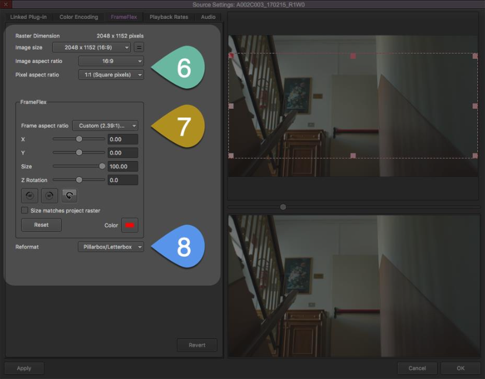

# USER GUIDE: CROPPING MULTIGROUPS IN AVID

This user guide teaches Assistant Editors how crop and reframe multi-camera groups in Avid Media Composer.

Some versions of Avid contain a bug that causes multigroups to display the wrong cropping. This guide explains how to work around the bug. Follow the guide’s steps to achieve the following results:

- Crop master clips to a new aspect ratio that stays in place throughout the edit process
- Display correct cropping on multigroups in the source monitor
- Display correct cropping on grouped clips in the program monitor

## Crop Your Master Clips

Follow the steps below to crop your master clips before multigrouping. 

1. Open the bins containing the footage to multigroup. Navigate to the A-Camera master clips.
   
3. Highlight and right-click the A-Camera master clips.
   
5. Select **Source Settings** in the dropdown menu to open the Source Settings pop-up box.
   
7. Click the **FrameFlex** tab in the Source Settings pop-up box.

   <figure style="text-align: center; margin-left: -20px;">
    
    <figcaption style="font-size: small; font-style: italic; color: darkblue; margin-top: 5px;">Fig. 1: Avid FrameFlex Settings</figcaption>
   </figure>

5. Set the Image Aspect Ratio to **16:9**. Set the Pixel Aspect Ratio to **1:1 (Square Pixels)**.
   
   See the **GREEN POINTER** in Fig. 1 for these settings. 

6. Set your desired Frame Aspect Ratio in the **Frame Aspect Ratio** dropdown menu.

   See the **ORANGE POINTER** in Fig. 1 for this setting.

7. Select **Pillarbox/Letterbox** in the **Reformat** dropdown menu.

   See the **BLUE POINTER** in Fig. 1 for this setting.

8. Click **Apply to All** at the bottom of the Source Settings pop-up box. This action conforms all A-Camera clips to the new aspect ratio.
   
9. Navigate to the X and Y position sliders in the FrameFlex box. You can find the sliders next to the **ORANGE POINTER** in Fig. 1.

10. Use the X and Y sliders to adjust the shot's framing.
    
    > **NOTE**: You **MUST** adjust the framing of every single clip to ensure correct display in
the final multigroup. This step prevents the Avid bug described in the introduction.
    >
    > Some shots may not need visible reframing. In these cases, enter **“0.01”** in a number box to the right of the X or Y slider. This step adjusts framing by a single pixel while avoiding any visible reframing.

12. Click **Apply** at the bottom of the Source Settings box. The next A-Camera clip appears in the box.

13. Use the X and Y sliders to adjust the shot’s framing, then click Apply. Repeat this process with all remaining A-Camera clips.

14. Click **OK** to exit the pop-up box after adjusting the final A-Camera clip.

15. Repeat Steps 2–13 with the B-Camera master clips and any additional camera clips,
if applicable.

16. Run your multigrouping process on the footage.
    > **NOTE**: I strongly recommend Group It For Me for Avid multigrouping.
    > 
    > Visit **[Group It For Me's Website](https://groupitforme.com/)** for more information.

## Format Your Multigroups

Format and finish your cropped multigroups with the steps below.

1. Open your multigroup in the source monitor. The footage may appear stretched or distorted. Hold off on fixing this issue for now.

2. Scrub through your multigroup. Check for any errors and out-of-sync clips.

3. Highlight all the **SUBCLIPS** (not master clips) in your multigroup bin. Sort your bin by
clip type to access all the subclips at once.

4. Right click the subclips. Select **Source Settings** in the dropdown menu to open the Source Settings pop-up box.

5. Click the **FrameFlex** tab in the Source Settings pop-up box.

6. Select **Pillarbox/Letterbox** in the Reformat dropdown menu.

   See the **BLUE POINTER** in **[Fig. 1](#crop-your-master-clips)** for this setting.

8. Click **Apply to All** at the bottom of the Source Settings pop-up box. This step conforms
the subclips to the correct dimensions and aspect ratio.

9. Click **OK** to exit the pop-up box.

10. Scrub through your multigroup again. Ensure that the whole multigroup displays the correct dimensions and aspect ratio. If any clip remains stretched or distorted, match back to that clip from the multigroup, then open the clip in the Source Settings box to troubleshoot.

11. Splice a clip from your multigroup into a blank sequence. Check the clip in the program monitor to ensure it displays the correct dimensions and aspect ratio.

