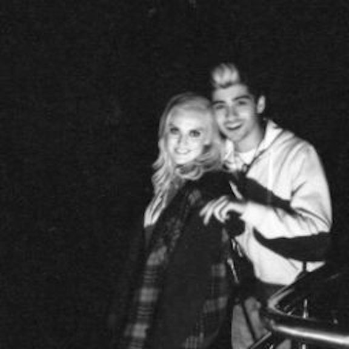
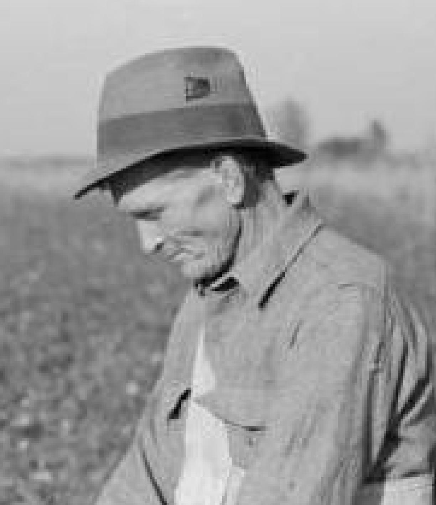
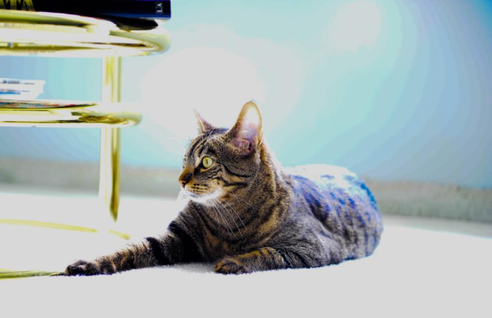
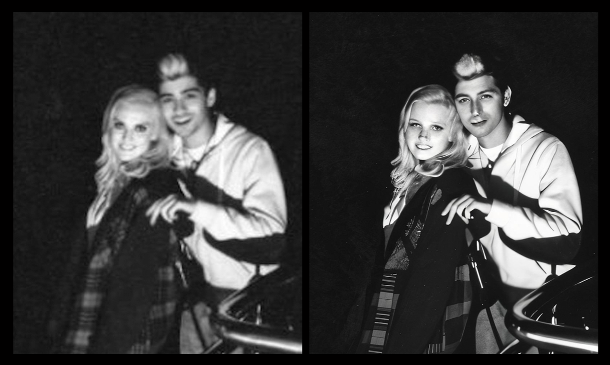

# ENHANCE YOUR IMAGES WITH AI UPSCALING

This guide outlines the AI upscaling process for users of all experience levels. Use this guide to master upscaling and create beautiful, high-resolution images.

## What is Upscaling?

**Upscaling** is the process of increasing an image’s size to enhance its clarity and detail. You may upscale small images to prepare them for large displays like print and video.

<figure style="text-align: center;">
    
    <figcaption style="font-size: small; font-style: italic; color: darkblue; margin-top: 5px;">Fig. 1: Upscaled Farmer Photo</figcaption>
</figure>

[CLICK HERE](https://photos.google.com/share/AF1QipNty46DjXDzvbgq69Bg8JJRdM2UpXvUKOXC_OKeY8ZaDesq2Hwu_2zopS_FDAYc4g/photo/AF1QipM2NUwwQNNjSkV75tR2CMHtQr8dDNWjo1g_gfHf?key=UnZmU2YwR2ZPVFNUSTR3YktiNGhUMkRWb2N6OVB3) to view a gallery of upscaled images.

The number of web-based upscaling models has soared with greater access to machine learning technology. [A Google Search](https://www.google.com/search?q=image+upscaling&oq=Image+Upscaling&gs_lcrp=EgZjaHJvbWUqBwgAEAAYgAQyBwgAEAAYgAQyBwgBEAAYgAQyBwgCEAAYgAQyBwgDEAAYgAQyBwgEEAAYgAQyBwgFEAAYgAQyBwgGEAAYgAQyBwgHEAAYgAQyBwgIEAAYgAQyBwgJEAAYgASoAgiwAgE&sourceid=chrome&ie=UTF-8) for **“Image Upscaling”** yields hundreds of results. Popular upscaling models include those by [Topaz Labs](https://www.topazlabs.com/gigapixel?utm_source=google&utm_medium=cpc&utm_campaign=S-Google-REM-Brand-BRD&attribution=true&g_acctid=883-417-5396&g_adgroupid=115851066361&g_keyword=topaz%20upscaler&g_campaign=S-PROS-Brand-TopCountries&g_campaignid=10023069988&g_adid=475915024441&g_network=g&g_adtype=search&g_keywordid=kwd-1238357235511&gad_source=1&gclid=Cj0KCQjwhb60BhClARIsABGGtw8iKH_7VCmxMQOUahJdZaZEZaEMLDFV6-PHYuVlt9ZxTr5LeoclN3IaAkVOEALw_wcB), [Nero](https://ai.nero.com/image-upscaler/?ref=artturijalli), and [Stockphotos](https://upscaler.stockphotos.com/?via=artturi46).

## Selecting Images to Upscale

Follow the guidelines below to select the best images for upscaling.

**Image Quality:** Upscale images with clear quality issues like blurriness, pixelation, and color-banding. High-quality images may not benefit from upscaling. See Figs. 2, 3, and 4 for examples of each quality issue.

**1. Blurriness:**

**2. Pixelation:**

**3. Color-Banding:**

**Image Size:** Upscale images larger than 200x200 pixels. Upscaling models may struggle to produce great results from tiny images. See Fig. 5 below.

**Lighting and Composition:** Upscale well-lit images with clearly defined subjects,
ideally with the subjects facing toward the camera. Upscaling models perform poorly with low-light images and faces in profile. See Fig. 6 below for an example of a clearly defined subject.

Upscaling can consume lots of time, RAM, and money. Do your best to find high-quality images and only upscale when necessary.

## Reviewing Your Upscaled Images

While upscaling models can enhance your images, they can also make mistakes. Carefully review the following aspects of your upscaled images:

**Resemblance:** Ensure that your upscaled image mirrors—or at least closely resembles—your original image. Upscaling models often take liberties with their high-resolution outputs.
See Fig. 7 below.

**Artifice:** Check for details that appear fake or stray into the uncanny valley. Backgrounds and skin textures are especially prone to this issue. See Fig. 8 below. 

**Facial Distortions:** Zoom in on each face to check for distortions, especially around the eyes and mouth. Upscaling models can distort whole faces as well as specific features. See Fig. 9 below. 

**Artifacts:** Check your upscaled image for objects, textures, and glitches that do not appear in your original image. Upscaling models may introduce artifacts to your image when filling in details. See Fig. 10 below.

## Troubleshooting and Tips

If your upscaled image displays any of the flaws mentioned above, adjust your model’s settings and re-upscale your original image. This process may involve some trial and error. Model settings may include scale factor, sharpness, and noise reduction. 

If your model fails repeatedly, upscale with a different model and adjust settings as needed. Different upscaling models can produce vastly different results. If the second model fails, your image may not be suitable for upscaling. 

As you refine your upscaling process, look out for new models as well as updates to existing ones. New upscaling models are constantly hitting the market, so keep your options open and find the models that work best for you.

